# 软件设计说明书 (SDD)

> 基于 IEEE 1016-2009 标准

## 文档控制

| 字段 | 值 |
|------|-----|
| 文档 ID | SDD-Calculator_Application-v1.0 |
| 版本 | 1.0 |
| 日期 | 2026-06-12 |
| 作者 | DevAgent (AI-assisted) |
| 状态 | Draft |

## 修订历史

| 版本 | 日期 | 作者 | 变更说明 |
|------|------|------|---------|
| 1.0 | 2026-06-12 | DevAgent | Initial design specification |

# 设计概述


## 1.1 系统架构

**架构模式**: layered

## 1.2 关键设计决策 (ADR)

### ADR-001: Use Decimal for Precise Arithmetic

- **状态**: Accepted

- **背景**: Floating-point precision issues in decimal calculations [RISK-01]

- **决策**: Use Python's Decimal type for all arithmetic operations

- **后果**: Eliminates floating-point rounding errors; slight performance overhead

- **考虑的替代方案**:

  - Use float: Floating-point precision issues

### ADR-002: Left-to-Right Evaluation Without Precedence

- **状态**: Accepted

- **背景**: Chain calculation order of operations ambiguity [RISK-02]

- **决策**: Evaluate chain calculations strictly left-to-right without operator precedence

- **后果**: Simple and predictable behavior; users must use parentheses if needed

- **考虑的替代方案**:

  - Standard precedence (PEMDAS): Increased complexity for simple calculator


## 1.3 设计目标

- **可维护性**: 模块化设计，单一职责原则
- **可测试性**: 依赖注入，接口隔离
- **安全性**: 纵深防御，最小权限原则
- **可扩展性**: 开放/封闭原则，策略模式

# 架构视图


## 2.1 系统上下文图 (C4 Level 1)

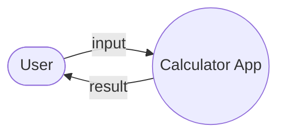

## 2.2 容器图 (C4 Level 2)

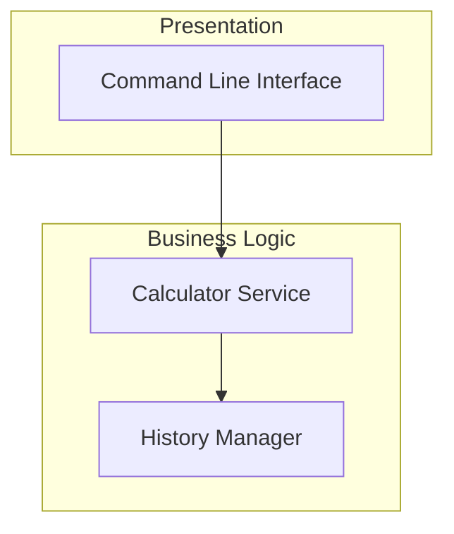

## 2.3 数据流图 Level 0 (系统上下文)

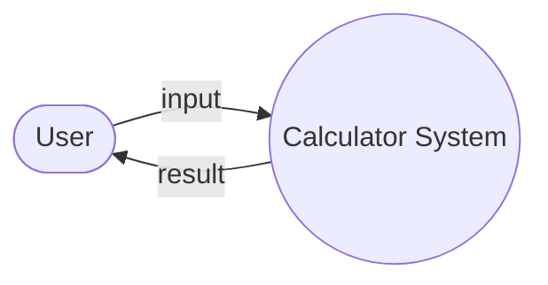

## 2.4 数据流图 Level 1 (过程分解)

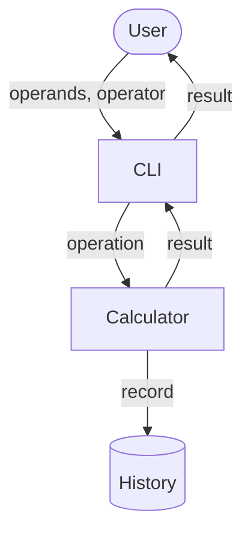

## 2.5 模块分解

### cli

- **职责**: Command-line interface for user interaction

- **依赖**: calculator

- **接口**:

  - `run()`

- **关键类**: `CLI`

### calculator

- **职责**: Core arithmetic operations and chain calculation logic

- **依赖**: 

- **接口**:

  - `add`

  - `subtract`

  - `multiply`

  - `divide`

  - `chain_calculate`

  - `get_history`

  - `clear_history`

- **关键类**: `Calculator`, `CalculationRecord`, `Operator`

#### 模块依赖图

```mermaid
flowchart TD
    subgraph cli[cli]
        cli_run__[/run()/]
    end
    cli --> calculator
    subgraph calculator[calculator]
        calculator_add[/add/]
        calculator_subtract[/subtract/]
        calculator_multiply[/multiply/]
        calculator_divide[/divide/]
        calculator_chain_calculate[/chain_calculate/]
        calculator_get_history[/get_history/]
        calculator_clear_history[/clear_history/]
    end
```

## 2.6 类图

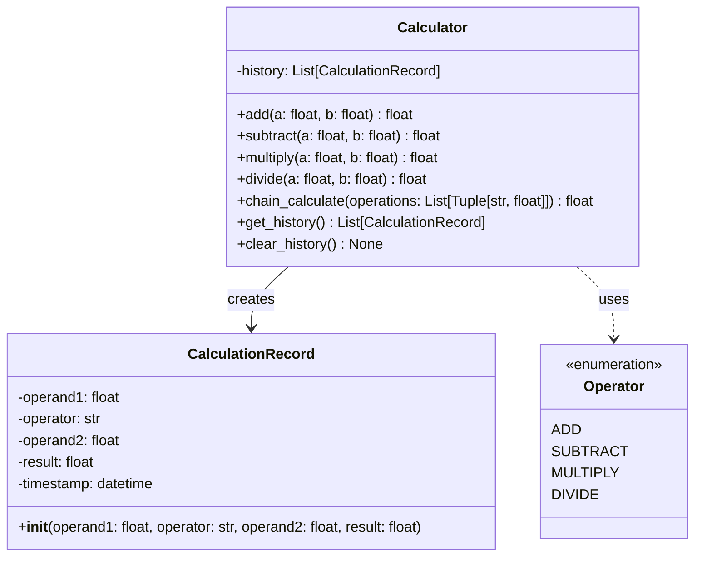

## 2.7 实体关系图 (ER)

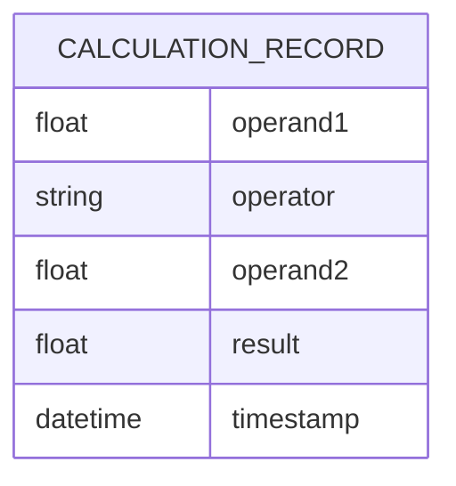

## 2.9 时序图

### Perform Basic Calculation

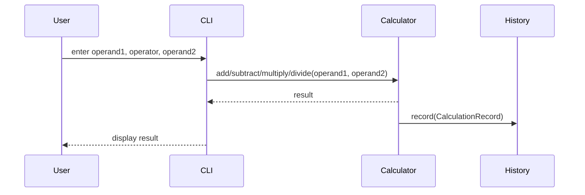

### Chain Calculation

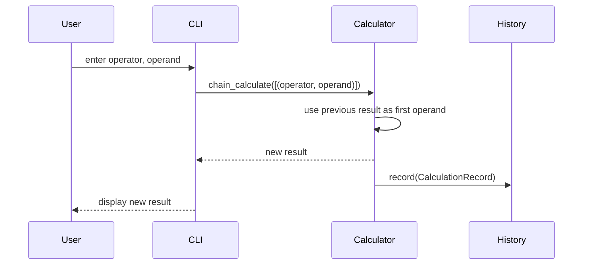

### View History

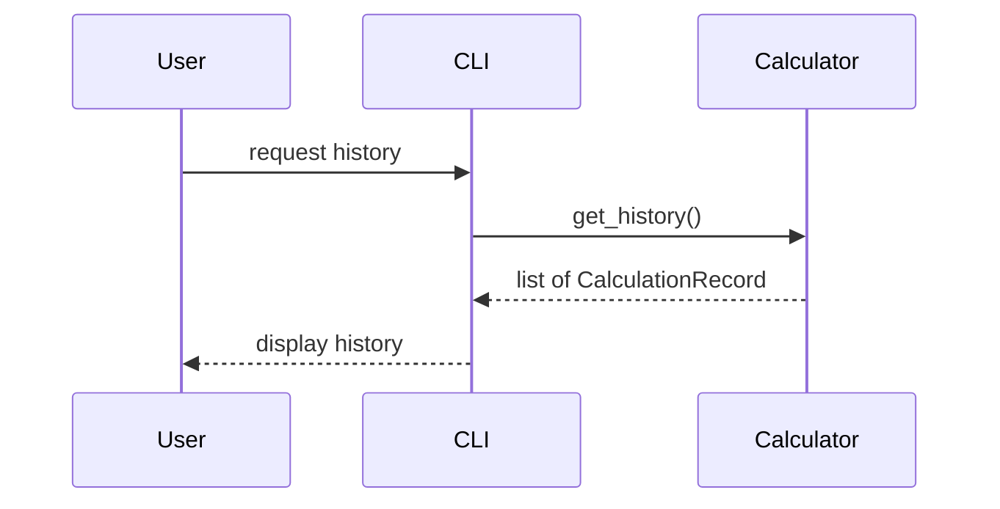

## 2.10 状态机图

### Calculator 状态机

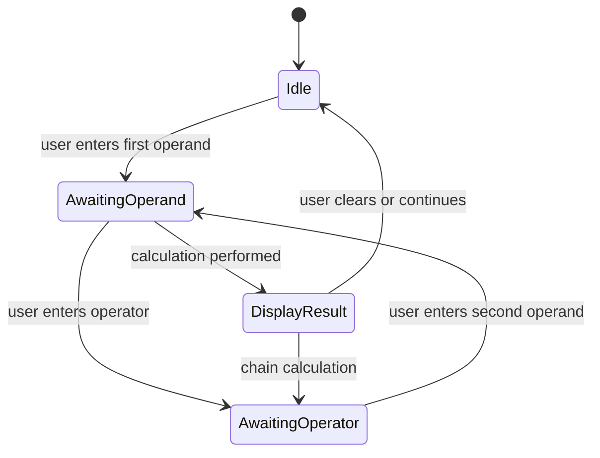

## 2.11 部署图

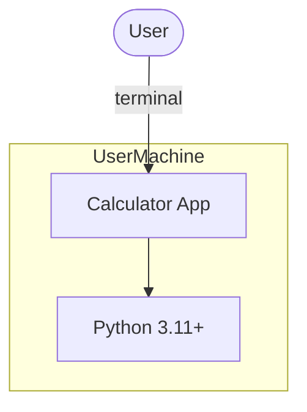

# 详细设计


## 3.2 关键接口

- **Calculator** (`calculator`)
  - 签名: `add(a: float, b: float) -> float`
  - 描述: Returns the sum of a and b

- **Calculator** (`calculator`)
  - 签名: `subtract(a: float, b: float) -> float`
  - 描述: Returns the difference of a and b

- **Calculator** (`calculator`)
  - 签名: `multiply(a: float, b: float) -> float`
  - 描述: Returns the product of a and b

- **Calculator** (`calculator`)
  - 签名: `divide(a: float, b: float) -> float`
  - 描述: Returns the quotient of a and b; raises ValueError on division by zero

- **Calculator** (`calculator`)
  - 签名: `chain_calculate(operations: List[Tuple[str, float]]) -> float`
  - 描述: Performs chain calculation left-to-right starting from current result

- **Calculator** (`calculator`)
  - 签名: `get_history() -> List[CalculationRecord]`
  - 描述: Returns list of all past calculations

- **Calculator** (`calculator`)
  - 签名: `clear_history() -> None`
  - 描述: Clears all history records


# 技术栈

| 类别 | 选择 | 理由 |
|------|------|------|
| language | Python 3.11+ | — |
| framework | None | Simple CLI application, no framework needed |
| database | None | History stored in-memory, no persistence required |
| cache | None | No caching needed |
| message_queue | None | No async processing needed |
| deployment | pip install | Standard Python package distribution |

# 安全视图 (STRIDE 威胁模型)

## Calculator Service

| 威胁类别 | 风险等级 | 缓解措施 |
|---------|---------|---------|
| Spoofing | Low | No authentication needed |
| Tampering | Low | Input validation ensures only valid numbers and operators |
| Repudiation | Low | History records all operations |
| Information Disclosure | Low | No sensitive data processed |
| Denial Of Service | Low | Single-user application |
| Elevation Of Privilege | Low | No privilege levels |

# 附录

## 术语表与缩略语

| 术语 | 定义 |
|------|------|
| **ADR** | Architecture Decision Record — 架构决策记录 |
| **C4** | Context, Containers, Components, Code — 架构可视化模型 |
| **DFD** | Data Flow Diagram — 数据流图 |
| **STRIDE** | Spoofing, Tampering, Repudiation, Information Disclosure, Denial of Service, Elevation of Privilege — 威胁建模框架 |
